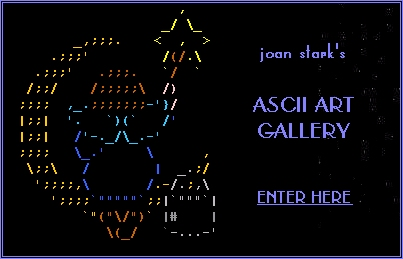

# Joan Stark's ASCII Art Gallery

Website of famous ascii-art artist [Joan Stark](https://en.wikipedia.org/wiki/Joan_Stark).  

Original website was running at http://www.geocities.com/SoHo/7373. But now it is available only in [WebArchive](https://web.archive.org/web/20091028013825/http://www.geocities.com/SoHo/7373/) or here in [Github Pages](https://oldcompcz.github.io/jgs/joan_stark/).

  
For more info about Joan Stark see [Wikipedia](https://en.wikipedia.org/wiki/Joan_Stark).

## How to run it

Just clone repository and run `joan_stark/index.html`  

(Needs to be cleaned and restored.)
 
